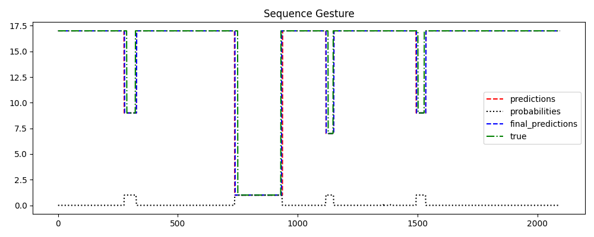
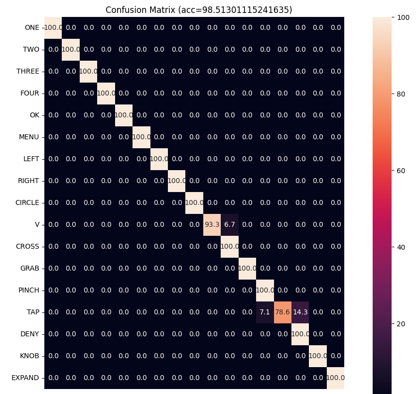

# AG-MAE

AG-MAE: Anatomically Guided Spatio-Temporal Masked Auto-Encoder for Online Hand Gesture Recognition


## **Updates**
- Trained models available soon !
  
## **Installation**
- Create and activate conda environment:
```
conda create -n agmae python=3.9
conda activate agmae
```
- Install all dependencies:
```
pip install -r requirements.txt
```
## **Dataset**
Download the [SHREC'21](https://univr-vips.github.io/Shrec21/) dataset. And set the path to training and test data in the `shrec21.yaml` file in the `configs/` folder.
```
 train_data_dir: './path/to/Train-set/'
 test_data_dir: './path/to/Test-set/'
```

## **Training**
- Online training:
```
bash ./scripts/train_online.sh
```

- Offline training:
```
bash ./scripts/train_offline.sh
```

## **Evaluation**
- Online Evaluation:
```
bash ./scripts/eval.sh
```
The predicted results will be stored at `./experiments/shrec21/random_60/results/online_evaluation_results.txt`. The evaluation scores can be calculated using the official Matlab code provided by the [Shrec'21](https://univr-vips.github.io/Shrec21/). 

## **Some visual results:**
- Example of reconstructed window:


- Example of predictions:


- Shrec'21 online confusion matrix:


- Shrec'21 offline confusion matrix:


We thank [MAE](https://github.com/facebookresearch/mae) and [STGCN](https://github.com/yysijie/st-gcn) for making their code available.
